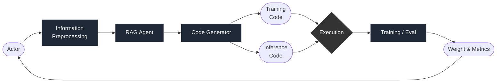

 # Reproducing the Benchmark Experiments

## 1. Purpose
This document provides step-by-step instructions for reproducing the automated pipeline generation, formal training, and evaluation conducted by our Agent. It serves as a guide for reviewers to execute the benchmark tasks under restricted computational environments and locate the generated execution logs.

---

## 2. Repository Structure
Based on our project architecture, the following directories and files are central to executing our experiments:

* `vision_benchmarks_colab.ipynb`: The ready-to-use Colab notebook for end-to-end formal training on 14 curated datasets.
* `pipeline.py`: The active integrated entry point of the project pipeline.
* `run_for_testing.py`: One-command pipeline entry for local testers and smoke tests.
* `run_kaggle_benchmark.py`: Prepares a formal training project for specific Kaggle competitions.
* `kaggle_submit.py`: Runs inference on hidden Kaggle test sets and formats `submission.csv`.
* `vision_benchmark_catalog.py`: Hardcoded registry containing our selected vision tasks, baselines, and prompts.
* `experiments/ab_loss_imbalance/`: Pre-registered A/B testing harness for class-imbalance scenarios.
* `test_runs/` (or `jiaozi_generated_training/`): Output directories where all generated codes, models, and logs are saved.

---

## 3. Environment Setup & Prerequisites
Before running the benchmarks, please configure your environment as follows:

### 3.1 Install Dependencies
To prevent compatibility issues with recent HuggingFace custom script restrictions, please enforce the `datasets` version before installing the main requirements:

```bash
/usr/bin/python3 -m pip install "datasets<3.0.0"
/usr/bin/python3 -m pip install -r requirements.txt
```

### 3.2 Configure API Keys (`.env`)
The system requires an LLM provider for Module 1 parsing and Module 4 code generation. 
1. Copy the template: `cp .env.example .env`
2. Populate the `.env` file with your preferred provider (e.g., OpenAI):

```text
M1_LLM_PROVIDER=openai
M4_LLM_PROVIDER=openai
OPENAI_API_KEY=sk-your-openai-api-key
```

### 3.3 Kaggle Credentials (For Kaggle Tasks)
If running Kaggle benchmarks such as `cassava`, ensure you have accepted the competition rules on Kaggle. You must provide `KAGGLE_API_TOKEN` in Colab Secrets or place `kaggle.json` in `~/.kaggle/` locally.

---

## 4. Main Experiment Pipeline
When running the integrated pipeline, the system autonomously navigates through the following closed-loop architecture:



---

## 5. Reproducing Benchmark Experiments
We offer two methods to reproduce our experiments. 

### Method A: Formal Benchmarking via Google Colab (Highly Recommended)
Because formal ML training requires GPU acceleration and large disk space, we highly recommend reproducing our formal training results via our Colab notebook.

1. Open `vision_benchmarks_colab.ipynb` in Google Colab.
2. Select a **T4 GPU runtime**.
3. In the Colab **Secrets** tab, add `OPENAI_API_KEY` (and `KAGGLE_API_TOKEN` if testing Kaggle tasks).
4. In the first code cell, modify the `BENCHMARK_KEY` variable to select the task. Supported keys from our catalog include:
   * `"cassava"`
   * `"siim_isic"`
   * `"diabetic_retinopathy"`
   * `"state_farm"`
   * `"cifar100"`
   * `"caltech101"`
   * `"food101"`
   👉 **[待更改: 最终真实测试的数据集。]**
5. Run all cells sequentially. The notebook will automatically download the dataset, generate the code, execute formal training (default `EPOCHS = 15`), and persist `best_model.pt` to Google Drive.

### Method B: Local CLI Execution
For reviewers wishing to run the pipeline locally:

**1. Run a Pre-registered Kaggle Benchmark**
To generate a project for a Kaggle competition using our Module 3 selection, and prepare it for local training:
```bash
python run_kaggle_benchmark.py cassava --data-root ./kaggle_data --output ./kaggle_run
cd ./kaggle_run/module4_code && python -u run.py --epochs 15
```

**2. Kaggle Inference and Submission Generation**
To predict on the hidden test set to generate `submission.csv`:
```bash
python kaggle_submit.py cassava --project ./kaggle_run/module4_code --data-root ./kaggle_data
```

**3. Test a Custom Query (Smoke Test Mode)**
To test the agent with a custom natural language prompt and bypass formal long training:
```bash
python run_for_testing.py \
  --dataset uoft-cs/cifar100 \
  --query "Classify small natural images into one hundred fine-grained categories." \
  --module4
```

---

## 6. Pre-Registered A/B Test Harness (Class Imbalance)
As a technical extension, we implemented a paired stratified 5-fold A/B testing harness to evaluate Cross-Entropy vs. Focal loss on imbalanced datasets. To reproduce this offline logic locally:

```bash
python -m experiments.ab_loss_imbalance.run_ab --testbed cassava --data-root ./kaggle_data --output ./ab_runs
python -m experiments.ab_loss_imbalance.collect
```

---

## 7. Experiment Outputs and Artifacts
Upon successful execution, the agent outputs artifacts into the designated directory (e.g., `/content/jiaozi_generated_training/` or `test_runs/`). Key files generated include:

* `configs.json`: The runtime configuration injected into Module 4 (including recipes like LR, image size).
* `generation_info.json`: Records the LLM prompt and response, tracking if fallback templates were used.
* `recommendations.json`: The Top-3 ranked model configurations from the GraphRAG.
* `model.py`, `train.py`, `evaluate.py`, `run.py`: The synthesized, executable PyTorch pipelines.
* `module4_summary.json`: The final evaluation report detailing task-specific metrics, `#Params`, and `runtime_sec`.

---

## 8. Official Experiment Logs Location
The official experimental logs corresponding to the "highest scores" reported in our `EXPERIMENTAL_RESULTS.md` and Final Presentation are securely stored in the following repository path:

👉 **[待补充: 填写最终实验的 log 文件夹的相对路径，例如 test_runs/final_logs/ ]**

Reviewers can directly inspect the `module4_summary.json` files within these folders to verify our reported benchmark metrics.

---

## 9. Troubleshooting
If you encounter runtime errors during reproduction, please refer to these common fixes:

* **Kaggle Download 403 Forbidden Error:**
  * *Solution:* Ensure you have accepted the competition rules on the Kaggle website for the specific dataset, and that your `KAGGLE_API_TOKEN` is correctly set.
* **HuggingFace Dataset Download Error (`trust_remote_code` issue):**
  * *Solution:* Enforce the older datasets library via `pip install "datasets<3.0.0"` and restart the Python session.
* **CUDA Out Of Memory (OOM):**
  * *Solution:* Ensure no other processes are occupying VRAM. If running locally, set `offline_smoke=true` in `configs.json` to prevent downloading full checkpoint weights during local smoke runs.
* **LLM API Rate Limit / 502 Bad Gateway:**
  * *Solution:* Large dataset metadata may occasionally trigger payload limits. Our Module 4 incorporates a robust fallback mechanism to switch to a deterministic template (`model.py`). You may also verify your API key in `.env` and retry.

👉 **[待补充: 还有可能会遇到的问题以及解决方案]**